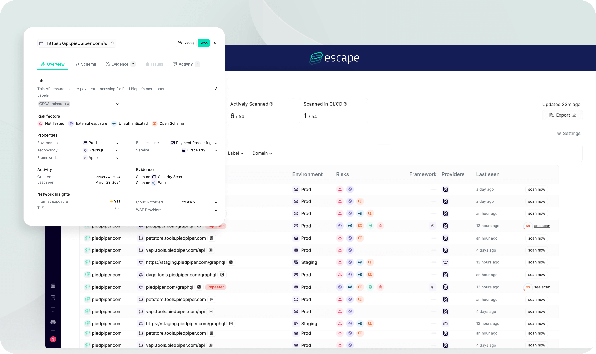

# 🏎️ Getting Started with the Inventory of your Applicative Assets

Escape Inventory gives a full view of every exposed API and Web Application across their entire Code-to-Cloud environments. It works with only a domain name and optional read-only integrations. By using advanced discovery without agents or traffic interception, it helps teams detect, fingerprint and classify all their applicative assets no matter where they are hosted. This level of visibility helps organizations understand their complete attack surface, making it easier to safeguard their assets.

The output consists of five filterable, sortable, and searchable tables or data frames listing all detected and fingerprinted Application Assets.
- **Table 1: API Services** – Represents root API services, each potentially encompassing multiple API Endpoints exposed on the Internet. Escape can detect or generate the associated API Schema, which contains multiple API Endpoints.
- **Table 2: API Schemas** – Offers a schema-first perspective on API Services. This view is especially valuable as some API Schemas, although detected within the research scope, are not linked to any specific API Service.
- **Table 3: Frontends** – Lists all detected web applications, frontends, and SPAs within the research scope.
- **Table 4: Sensitive Data & Secrets** – Lists all potential Sensitive Data and Secrets exposed on the Internet with a very low false positive rate, considering factors like the surrounding code, data flow, and access patterns.
- **Table 5: Repositories & Code Projects** – When a Git-based Version Control System (VCS) is connected, this allows linking directly the exposed API Services with the right Code Projects in Repositories, including the Code Owners.

## How does it work? 

Escape Inventory requires at least a domain name as input, and optionally a variety of read-only integrations.
It uses a combination of open-source and proprietary AI-technologies to provide an exhaustive and enriched Inventory of all the Applicative Assets exposed by an organization.

### Supported Application Assets:

* **APIs:** REST, GraphQL, gRPC, WebSocket, SOAP, etc.  
* **API Schemas:** OpenAPI Specification, GraphQL Introspection, Postman Collections, etc.  
* **Web Apps:** Frontends, Single Page Applications (SPA), etc.

### Fingerprinted Characteristics of Application Assets:

* **Network Scope:** External, Internal  
* **Status:** Current, Zombie, Legacy, Shadow  
* **Environment:** Production, Staging, Development  
* **Technology:** REST, GraphQL, etc.  
* **Framework:** Flask, Laravel, Next.js, etc.  
* **Cloud Hosting:** AWS, Azure, OVH, Akamai, GCP, etc.  
* **Firewall:** Cloudflare, AWS ELB, Azure WAF, Akamai Firewall, etc.  
* **Authentication:** Keycloak, Auth0, API Key, etc.
* **Code Owners:** Requires integration with a Git Hosting Service.

### Risk Detection for Exposed APIs

* Leakage of Sensitive Data and Secrets  
* External Exposure  
* Disclosure of API Documentation  
* Lack of Authentication or Authorization  
* Detection of Critical Vulnerabilities