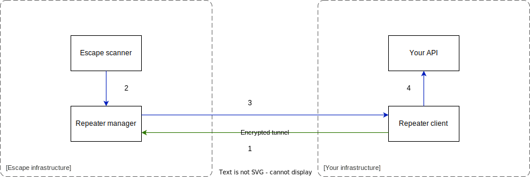

# 🐼 Whitelist scanner requests

You might need to identify when the request you receive is coming from the security scanner.

For instance, you probably don't want the many requests being sent to your server from the scanner to appear in your monitoring tool, or, you might want to enable the introspection of your server only to the security scanner on your staging environment.

## Using the 'x-escape-identifier' HTTP Header

Escape's scanner sends a secure token attached to every requests it sends. The header name is `x-escape-identifier` and its value is an identification token attached to your organization.

```http
x-escape-identifier: {{your-escape-identifier}}
```

Thanks to this header you can detect incoming requests from the scanner in your server, to add any custom handling logic you might want on top of this.

You can find this token in your [organization settings](https://app.escape.tech/organization/settings/).

You should keep this token secret. If you think it has been compromised, you can regenerate it in your [organization settings](https://app.escape.tech/organization/settings/) using the `Revoke` button.

## Application behind a firewall

If your application is behind a firewall for security reasons, you might not be able to scan it by default with Escape.
This section will help you to configure a secure route only accessible by Escape's scanner.

### Using the Escape proxy

If you can whitelist some IPs in your firewall, you can use the Escape proxy to scan your application.

To do so, you need to add the following parameter to your scan configuration :

```json
{
    "params": {
        "client": {
            "proxy": {
                "type": "escape"
            }
        }
    }
}
```

All requests sent by the scanner will be sent to your application through this proxy. The following IPs are used :

- IPv4 : `163.172.168.233`
- IPv6 : `2001:bc8:47a4:61f::1`

Now you need to whitelist these IPs in your firewall.

### Using a custom proxy

If you can't whitelist IPs but you can deploy a service and expose it's IP, you can use a custom proxy to scan your application.

First you will need to deploy a proxy that can access your API.
For that you can use the [Escape proxy](https://github.com/Escape-Technologies/proxy) or any other proxy you want.
You will also need to allow incoming trafic to this proxy in your firewall.

Now you must have the following information :

- `user` : the user allowed to connect to the proxy (your organization id if you use the Escape proxy)
- `password` : the password of the user allowed to connect to the proxy (your api key if you use the Escape proxy)
- `ip` : the ip to connect to your proxy
- `port` : the port to connect to your proxy

Then you can add the following parameter to your scan configuration :

```json
{
    "params": {
        "client": {
            "proxy": {
                "type": "http",
                "target": "http://[user]:[password]@[ip]:[port]"
            }
        }
    }
}
```

Check the [Client](https://escape.tech/docs/advanced-usage/parameters#client) for more details.

## Using the escape repeater

:::warning WIP

This feature is in Private Beta. Contact us via email or your Private Slack Support Channel for more information.

:::

You can also use the Escape repeater to scan your application.

This repeater creates a private tunnel between Escape and one of your servers.
All the escape requests will comes from this server.

Here is a schema of the infrastructure :



First, the repeater client you have deployed locally will connect to the repeater manager (1).
When you start a scan on escape, instead of sending the requests directly to your server, Escape will send them to the repeater manager (2).
Your client will receive the requests and send them to your server (3 & 4).
The results are sent back to Escape to allow you to see scans results.
