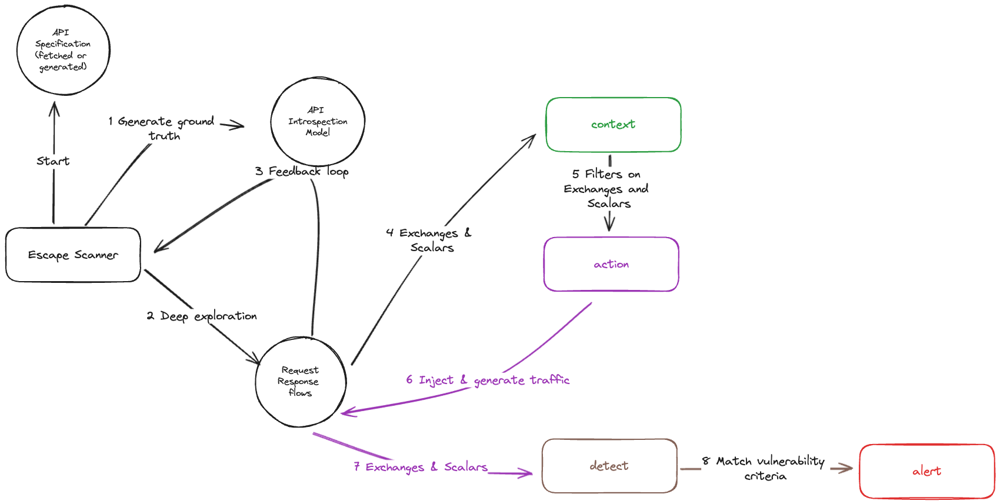

# Custom security tests

Escape enables you to write custom tests by leveraging the intelligent exploration of your APIs and their scalars.

This enables specific business logic tests, or broader company policies to be validated against all your APIs, or a subset of them.

## Overview



Here's an overview of how Escape can help you narrow down your target, your testing, detection and alerting.

In a YAML format, you can define a Security Check that defines 5 blocks:

- `http` to send a raw HTTP request to your API at each scan start
- `context` to filter on what the scanner explores, specific or not to a protocol thanks to schema abstractions, and knowing what kind of data is there (using scalars)
- `action` to trigger a test, select a specific part of a request, or 
- `detect` to see if your test successfully broke your targeted context
- `alert` to fill out details and alert your team(s)


## Quickstart example

We will enter in more details for each one of these blocks, but here is the general structure of a custom security check:

```yaml
custom_checks:
  - name: "Admin account delete"

    context:
      - key: schema.route.path
        end_with: /user
      - key: schema.route.crud
        in:
          - "DELETE"

    action:
      - set_key: request.body
        selector: email
        value: "admin@escape.tech"

    detection:
      - key: response.status_code
        is: 200

    alert:
      name: Admin deletion
      title:
        on_pass: Admin is safe
        on_fail: Admin account was deleted
      context: |
        We successfully deleted the admin account.
      description: |
        The account `admin@escape.tech` is created for compliance reasons.
        It should not be deletable even by another admin and must always be present.
      remediation: |
        Check the email of the user before deleting it.
        Please contact the security team if you need help to understand why this is a problem.
      severity: HIGH
  
  
  - name: "Admin account present"
    
    raw_http:
      payload: |
        GET /user?email=admin%40escape.tech HTTP/1.1
        Accept: application/json

    detection:
      - key: response.status_code
        is_not: 200

    alert:
      name: Admin account
      title:
        on_pass: Admin is safe
        on_fail: Admin account is not present
      context: |
        The admin account is not present.
      description: |
        The account `admin@escape.tech` is created for compliance reasons.
        It should not be deletable even by another admin and must always be present.
      remediation: |
        On database seed of your application, please create the admin account.
        Please contact the security team if you need help to understand why this is a problem.
      severity: HIGH
```

## Full example 

<details>

```yaml
custom_checks:
  - name: "My custom check"

    raw_http:
      payload: |
        GET /user HTTP/1.1
        Accept: application/json

    context:
      - key: schema.route.path
        contains: /api/{resource}

      - key: schema.route.method
        in:
          - "GET"
          - "POST"
          - "PUT"

      - key: schema.route.scalars.types
        contains:
          - "USER"
          - "EMAIL"
          - "PASSWORD"
          - "URL"

      - key: schema.route.scalars.sensitivity
        gt: 0.5

    action:

      - set_key: request.body
        selector: param_name
        value: "{{modify_value}}"

      - set_key: request.body
        selector: param_name2
        values:
          - "{{modify_value}}"
          - "{{modify_value2}}"

      - set_key: request.headers
        selector: Content-Type
        value: "{{modify_value}}"

      - set_key: helpers.request.scalars
        scalar: "EMAIL"
        value: "{{modify_value}}"

      - set_key: helpers.request.scalars
        scalar: "URL"
        auto_payloads: true

      - set_key: request.body
        jq: '. | {"user": .user + " {{modify_value}}"}'

      - set_key: helpers.request.arguments
        selector: arg_name
        value: "{{modify_value}}"

    detection:
      - key: response.status_code
        is: 200

      - key: response.body
        contains: "{{expected_content}}"

      - key: response.time
        gt: 20
        lt: 200

      - key: helpers.response.is_successful
        is: true

      - key: helpers.response.scalars.detected
        contains:
          - "PASSWORD"

      - key: helpers.response.scalars.sensitivity
        gt: 0.5

      - key: helpers.request.arguments
        contains:
          - "query"

      - key: helpers.request.crud
        in:
          - "CREATE"

      - key: response.json
        jq: '.message == "ok"'

    alert:
      name: Escape emails
      title:
        on_pass: Email check is compliant
        on_fail: Only escape employee can register
      context: |
        On our production environment, only escape emails are allowed.
      description: |
        Call the security team if you need ...
      remediation: |
        Do a validation before registering a user ...
      severity: HIGH
```

</details>